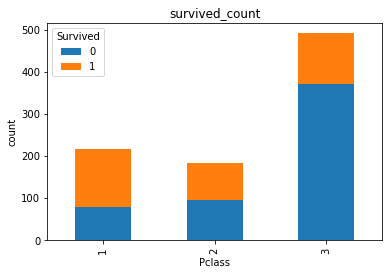

**复习：**回顾学习完第一章，我们对泰坦尼克号数据有了基本的了解，也学到了一些基本的统计方法，第二章中我们学习了数据的清理和重构，使得数据更加的易于理解；今天我们要学习的是第二章第三节：**数据可视化**，主要给大家介绍一下Python数据可视化库Matplotlib，在本章学习中，你也许会觉得数据很有趣。在打比赛的过程中，数据可视化可以让我们更好的看到每一个关键步骤的结果如何，可以用来优化方案，是一个很有用的技巧。

# 2 第二章：数据可视化

#### 开始之前，导入numpy、pandas以及matplotlib包和数据


```python
# 加载所需的库
# 如果出现 ModuleNotFoundError: No module named 'xxxx'
# 你只需要在终端/cmd下 pip install xxxx 即可
%matplotlib inline
import numpy as np
import pandas as pd
import matplotlib.pyplot as plt
```

%matplotlib inline这一句是IPython的魔法函数，作用是内嵌画图，省略掉plt.show()这一步，直接显示图像。
如果不加这一句的话，在画图结束之后需要加上plt.show()才可以显示图像。


```python
#加载result.csv这个数据   为什么要加r
text = pd.read_csv('result.csv')
text.head()
```


<div>
<style scoped>
    .dataframe tbody tr th:only-of-type {
        vertical-align: middle;
    }

    .dataframe tbody tr th {
        vertical-align: top;
    }

    .dataframe thead th {
        text-align: right;
    }
</style>
<table border="1" class="dataframe">
  <thead>
    <tr style="text-align: right;">
      <th></th>
      <th>Unnamed: 0</th>
      <th>PassengerId</th>
      <th>Survived</th>
      <th>Pclass</th>
      <th>Name</th>
      <th>Sex</th>
      <th>Age</th>
      <th>SibSp</th>
      <th>Parch</th>
      <th>Ticket</th>
      <th>Fare</th>
      <th>Cabin</th>
      <th>Embarked</th>
    </tr>
  </thead>
  <tbody>
    <tr>
      <th>0</th>
      <td>0</td>
      <td>1</td>
      <td>0</td>
      <td>3</td>
      <td>Braund, Mr. Owen Harris</td>
      <td>male</td>
      <td>22.0</td>
      <td>1</td>
      <td>0</td>
      <td>A/5 21171</td>
      <td>7.2500</td>
      <td>NaN</td>
      <td>S</td>
    </tr>
    <tr>
      <th>1</th>
      <td>1</td>
      <td>2</td>
      <td>1</td>
      <td>1</td>
      <td>Cumings, Mrs. John Bradley (Florence Briggs Th...</td>
      <td>female</td>
      <td>38.0</td>
      <td>1</td>
      <td>0</td>
      <td>PC 17599</td>
      <td>71.2833</td>
      <td>C85</td>
      <td>C</td>
    </tr>
    <tr>
      <th>2</th>
      <td>2</td>
      <td>3</td>
      <td>1</td>
      <td>3</td>
      <td>Heikkinen, Miss. Laina</td>
      <td>female</td>
      <td>26.0</td>
      <td>0</td>
      <td>0</td>
      <td>STON/O2. 3101282</td>
      <td>7.9250</td>
      <td>NaN</td>
      <td>S</td>
    </tr>
    <tr>
      <th>3</th>
      <td>3</td>
      <td>4</td>
      <td>1</td>
      <td>1</td>
      <td>Futrelle, Mrs. Jacques Heath (Lily May Peel)</td>
      <td>female</td>
      <td>35.0</td>
      <td>1</td>
      <td>0</td>
      <td>113803</td>
      <td>53.1000</td>
      <td>C123</td>
      <td>S</td>
    </tr>
    <tr>
      <th>4</th>
      <td>4</td>
      <td>5</td>
      <td>0</td>
      <td>3</td>
      <td>Allen, Mr. William Henry</td>
      <td>male</td>
      <td>35.0</td>
      <td>0</td>
      <td>0</td>
      <td>373450</td>
      <td>8.0500</td>
      <td>NaN</td>
      <td>S</td>
    </tr>
  </tbody>
</table>
</div>


### 2.7 如何让人一眼看懂你的数据？
《Python for Data Analysis》第九章

#### 2.7.1 任务一：跟着书本第九章，了解matplotlib，自己创建一个数据项，对其进行基本可视化

【思考】最基本的可视化图案有哪些？分别适用于那些场景？（比如折线图适合可视化某个属性值随时间变化的走势）

#这一部分需要了解可视化图案的的逻辑，知道什么样的图案可以表达什么样的信号
折线图——查看数据的变化趋势

柱状图——对于离散型数据，我们可以看到不同类别之间的分布情况

堆积柱状图——不仅能比较各类别总体区别，还能同时还能看出每个类别中子成分的占比情况

条形图——水平条形图在类别名称很长的时候非常方便

直方图——查看数据集的分布情况

箱线图——用来展示数据的描述统计信息（即四分位数）

散点图——描述数据之间的相关性

饼图——用面积表示一组数据的占比

参考：https://blog.csdn.net/weixin_44755148/article/details/89674885

#### 2.7.2 任务二：可视化展示泰坦尼克号数据集中男女中生存人数分布情况（用柱状图试试）。


```python
sex_sum = text.groupby('Sex')['Survived'].sum()
sex_sum.plot.bar()
plt.title('survived_count')#思考题回答
plt.show()
```


    

    


【思考】计算出泰坦尼克号数据集中男女中死亡人数，并可视化展示？如何和男女生存人数可视化柱状图结合到一起？看到你的数据可视化，说说你的第一感受（比如：你一眼看出男生存活人数更多，那么性别可能会影响存活率）。


```python
#男女中死亡人数分布情况
sex_survived=text.groupby(['Sex','Survived'])['Survived'].count().unstack()
sex_survived
```


<div>
<style scoped>
    .dataframe tbody tr th:only-of-type {
        vertical-align: middle;
    }

    .dataframe tbody tr th {
        vertical-align: top;
    }

    .dataframe thead th {
        text-align: right;
    }
</style>
<table border="1" class="dataframe">
  <thead>
    <tr style="text-align: right;">
      <th>Survived</th>
      <th>0</th>
      <th>1</th>
    </tr>
    <tr>
      <th>Sex</th>
      <th></th>
      <th></th>
    </tr>
  </thead>
  <tbody>
    <tr>
      <th>female</th>
      <td>81</td>
      <td>233</td>
    </tr>
    <tr>
      <th>male</th>
      <td>468</td>
      <td>109</td>
    </tr>
  </tbody>
</table>
</div>


```python
sex_survived[0].plot.bar()
plt.title('died')
```


    Text(0.5, 1.0, 'died')


    

    


#### 2.7.3 任务三：可视化展示泰坦尼克号数据集中男女中生存人与死亡人数的比例图（用柱状图试试）。# 提示：计算男女中死亡人数 1表示生存，0表示死亡


```python
#不使用stack的效果
text.groupby(['Sex','Survived'])['Survived'].count().plot.bar()

```


    <AxesSubplot:xlabel='Sex,Survived'>


    

    


注意count是对index进行计数，与sum的区别

数据的层次化结构有两种，一种是表格dataframe，另一种是series。stack就是dataframe转series，unstack就是series转dataframe
data.unstack（level=-1）#-1是默认参数，把第二层变成行索引


```python
#使用stack的效果,
data1=text.groupby(['Sex','Survived'])['Survived'].count().unstack()
data1.plot.bar()#画图未堆叠 横坐标是列索引

data1.plot.bar(stacked='True')#画图堆叠，横坐标是列索引

plt.title('survived_count')

plt.ylabel('count')
```


    Text(0, 0.5, 'count')


    

    


    

    


【提示】男女这两个数据轴，存活和死亡人数按比例用柱状图表示

#### 2.7.4 任务四：可视化展示泰坦尼克号数据集中不同票价的人生存和死亡人数分布情况。（用折线图试试）（横轴是不同票价，纵轴是存活人数）

【提示】对于这种统计性质的且用折线表示的数据，你可以考虑将数据排序或者不排序来分别表示。看看你能发现什么？


```python
# 计算不同票价中生存与死亡人数 1表示生存，0表示死亡
text.groupby(['Fare'])['Survived'].count()
```


    Fare
    0.0000      15
    4.0125       1
    5.0000       1
    6.2375       1
    6.4375       1
                ..
    227.5250     4
    247.5208     2
    262.3750     2
    263.0000     4
    512.3292     3
    Name: Survived, Length: 248, dtype: int64


```python
text.groupby(['Fare'])['Survived'].value_counts()
```


    Fare      Survived
    0.0000    0           14
              1            1
    4.0125    0            1
    5.0000    0            1
    6.2375    0            1
                          ..
    247.5208  1            1
    262.3750  1            2
    263.0000  0            2
              1            2
    512.3292  1            3
    Name: Survived, Length: 330, dtype: int64


```python
text.groupby(['Sex','Survived'])['Survived'].value_counts()
```


    Sex     Survived  Survived
    female  0         0            81
            1         1           233
    male    0         0           468
            1         1           109
    Name: Survived, dtype: int64


```python
text.groupby(['Sex','Survived'])['Survived'].count()
```


    Sex     Survived
    female  0            81
            1           233
    male    0           468
            1           109
    Name: Survived, dtype: int64


count与value_conuts
（1）groupby(‘A’)[‘B’].count()，统计的还是A的特征
（2）groupby(‘A’)[‘B’].value_counts()，统计的是B的特征
如任务四，结果不同

如果是
（1）groupby(‘A’，‘B’)[‘B’].count()，统计的是A，B的特征
（2）groupby(‘A’，‘B’)[‘B’].value_counts()，统计的是B的特征
如任务三，两个函数结果相同


```python
fare_sur = text.groupby(['Fare'])['Survived'].value_counts().sort_values(ascending=False)
fare_sur
#这个答案有点问题，因为横坐标的格式是坐标形式，可看性不好
```


```python
#方法一
fare_sur = text.groupby(['Fare'])['Survived'].sum()
fare_sur.head(20)
```


    Fare
    0.0000    1
    4.0125    0
    5.0000    0
    6.2375    0
    6.4375    0
    6.4500    0
    6.4958    0
    6.7500    0
    6.8583    0
    6.9500    0
    6.9750    1
    7.0458    0
    7.0500    0
    7.0542    0
    7.1250    0
    7.1417    1
    7.2250    3
    7.2292    4
    7.2500    1
    7.3125    0
    Name: Survived, dtype: int64


```python
fig = plt.figure(figsize=(20, 18))
fare_sur.plot(grid=True)
plt.legend()
plt.show()
```


    

    


```python
#方法二
fare_sur =text.groupby(['Fare','Survived'])['Survived'].count().unstack()
fare_sur
```


<div>
<style scoped>
    .dataframe tbody tr th:only-of-type {
        vertical-align: middle;
    }

    .dataframe tbody tr th {
        vertical-align: top;
    }

    .dataframe thead th {
        text-align: right;
    }
</style>
<table border="1" class="dataframe">
  <thead>
    <tr style="text-align: right;">
      <th>Survived</th>
      <th>0</th>
      <th>1</th>
    </tr>
    <tr>
      <th>Fare</th>
      <th></th>
      <th></th>
    </tr>
  </thead>
  <tbody>
    <tr>
      <th>0.0000</th>
      <td>14.0</td>
      <td>1.0</td>
    </tr>
    <tr>
      <th>4.0125</th>
      <td>1.0</td>
      <td>NaN</td>
    </tr>
    <tr>
      <th>5.0000</th>
      <td>1.0</td>
      <td>NaN</td>
    </tr>
    <tr>
      <th>6.2375</th>
      <td>1.0</td>
      <td>NaN</td>
    </tr>
    <tr>
      <th>6.4375</th>
      <td>1.0</td>
      <td>NaN</td>
    </tr>
    <tr>
      <th>...</th>
      <td>...</td>
      <td>...</td>
    </tr>
    <tr>
      <th>227.5250</th>
      <td>1.0</td>
      <td>3.0</td>
    </tr>
    <tr>
      <th>247.5208</th>
      <td>1.0</td>
      <td>1.0</td>
    </tr>
    <tr>
      <th>262.3750</th>
      <td>NaN</td>
      <td>2.0</td>
    </tr>
    <tr>
      <th>263.0000</th>
      <td>2.0</td>
      <td>2.0</td>
    </tr>
    <tr>
      <th>512.3292</th>
      <td>NaN</td>
      <td>3.0</td>
    </tr>
  </tbody>
</table>
<p>248 rows × 2 columns</p>
</div>


```python
fare_sur.plot()#默认是折线图，注意两列数据自动用两条颜色线表示
```


    <AxesSubplot:xlabel='Fare'>


    

    


#### 2.7.5 任务五：可视化展示泰坦尼克号数据集中不同仓位等级的人生存和死亡人员的分布情况。（用柱状图试试）


```python
#方法1
# 1表示生存，0表示死亡
pclass_sur = text.groupby(['Pclass'])['Survived'].value_counts().unstack()

pclass_sur.plot.bar()#画图未堆叠 横坐标是列索引

pclass_sur.plot.bar(stacked='True')#画图堆叠，横坐标是列索引

plt.title('survived_count')

plt.ylabel('count')

```


    Text(0, 0.5, 'count')


    

    


    

    


```python
#方法2 不需要用groupby机制
import seaborn as sns
sns.countplot(x="Pclass", hue="Survived", data=text)
```


    <AxesSubplot:xlabel='Pclass', ylabel='count'>


    

    


【思考】看到这个前面几个数据可视化，说说你的第一感受和你的总结


```python
（1）count与value_count的不同，见上面的总结
（2）stack的bar更加直观#思考题回答


```

#### 2.7.6 任务六：可视化展示泰坦尼克号数据集中不同年龄的人生存与死亡人数分布情况。(不限表达方式)

Seaborn学习——构建结构化多绘图网格（FacetGrid(）、map()）
即数据集的不同子集上绘制同一图的多个实例

（1）先sns.FacetGrid画出轮廓  
（2）然后用map填充内容

FacetGrid参数
FacetGrid(data, row=None, col=None, hue=None, col_wrap=None, sharex=True, sharey=True, height=3, aspect=1, palette=None, row_order=None, col_order=None, hue_order=None, hue_kws=None, dropna=True, legend_out=True, despine=True, margin_titles=False, xlim=None, ylim=None, subplot_kws=None, gridspec_kws=None, size=None)

row：显示几行子集图 col：显示几列子集图   hue表示通过颜色表示不同变量

aspect：纵横比，是说每个小图的横轴长度和纵轴的比

参考链接：https://blog.csdn.net/weixin_42398658/article/details/82960379

sns.kdeplot 核密度估计图


```python
facet = sns.FacetGrid(text, hue="Survived",aspect=3)
facet.map(sns.kdeplot,'Age',shade= True)
facet.set(xlim=(0, text['Age'].max()))
facet.add_legend()


```


    <seaborn.axisgrid.FacetGrid at 0x191d4e29370>


    

    


```python
#方法二

text.Age[text.Survived==0].hist(bins=5,alpha=0.5)#死亡人数-年龄直方图
text.Age[text.Survived==1].hist(bins=5,alpha=0.5)#生存人数-年龄直方图 alpha=0.5 颜色透明度
plt.legend((0,1))
plt.xlabel('Age')
plt.ylabel('count')
```


    Text(0, 0.5, 'count')


    

    


```python
#密度分布
text.Age[text.Survived==0].hist(bins=5,alpha=0.5,density=1)#死亡人数-年龄直方图
text.Age[text.Survived==1].hist(bins=5,alpha=0.5,density=1)#生存人数-年龄直方图 alpha=0.5 颜色透明度
text.Age[text.Survived==0].plot.density()
text.Age[text.Survived==1].plot.density()
plt.legend((0,1))
plt.xlabel('Age')
plt.ylabel('density')
```


    Text(0, 0.5, 'density')


    

    


#### 2.7.7 任务七：可视化展示泰坦尼克号数据集中不同仓位等级的人年龄分布情况。（用折线图试试）


```python
#方法一 核密度估计图 kde
text.Age[text.Pclass == 1].plot(kind='kde')
text.Age[text.Pclass == 2].plot(kind='kde')
text.Age[text.Pclass == 3].plot(kind='kde')
plt.xlabel('age')
plt.legend((1,2,3),loc='best')


```


    <matplotlib.legend.Legend at 0x257481ab220>


    

    


```python
#方法二
unique_pclass=text.Pclass.unique()
unique_pclass.sort()
unique_pclass
```


    array([1, 2, 3], dtype=int64)


```python
for i in unique_pclass:
    text.Age[text.Pclass == i].plot.density()
plt.xlabel('age')
plt.legend(unique_pclass)
```


    <matplotlib.legend.Legend at 0x25748410700>


    

    


```python
#方法三 seaborn
import seaborn as sns
for i in unique_pclass:
    sns.kdeplot(text.Age[text.Pclass==i],shade=True,linewidth=0)
plt.xlabel('age')
plt.legend(unique_pclass)
```


    <matplotlib.legend.Legend at 0x257487930d0>


    

    


【思考】上面所有可视化的例子做一个总体的分析，你看看你能不能有自己发现

【总结】到这里，我们的可视化就告一段落啦，如果你对数据可视化极其感兴趣，你还可以了解一下其他可视化模块，如：pyecharts，bokeh等。

如果你在工作中使用数据可视化，你必须知道数据可视化最大的作用不是炫酷，而是最快最直观的理解数据要表达什么，你觉得呢？
