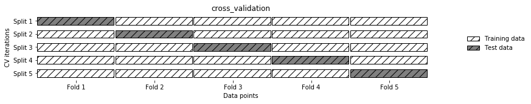
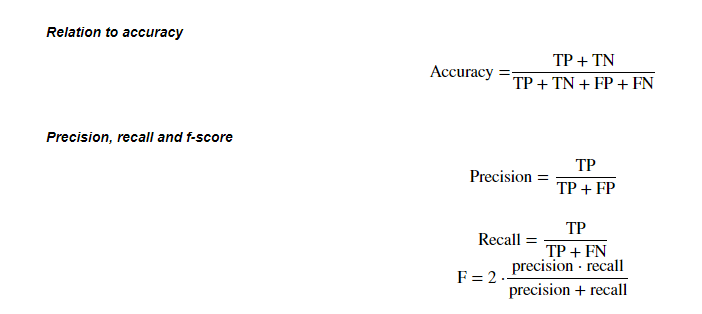

## 第三章 模型搭建和评估-评估

根据之前的模型的建模，我们知道如何运用sklearn这个库来完成建模，以及我们知道了的数据集的划分等等操作。那么一个模型我们怎么知道它好不好用呢？以至于我们能不能放心的使用模型给我的结果呢？那么今天的学习的评估，就会很有帮助。

加载下面的库


```python
import pandas as pd
import numpy as np
import seaborn as sns
import matplotlib.pyplot as plt
from IPython.display import Image
from sklearn.linear_model import LogisticRegression
from sklearn.ensemble import RandomForestClassifier
```


```python
%matplotlib inline
```


```python
plt.rcParams['font.sans-serif'] = ['SimHei']  # 用来正常显示中文标签
plt.rcParams['axes.unicode_minus'] = False  # 用来正常显示负号
plt.rcParams['figure.figsize'] = (10, 6)  # 设置输出图片大小
```

**任务：加载数据并分割测试集和训练集**


```python
from sklearn.model_selection import train_test_split

```


```python
# 一般先取出X和y后再切割，有些情况会使用到未切割的，这时候X和y就可以用,x是清洗好的数据，y是我们要预测的存活数据'Survived'
data = pd.read_csv('clear_data.csv')
train = pd.read_csv('train.csv')
X = data
y = train['Survived']
```


```python
# 对数据集进行切割
X_train, X_test, y_train, y_test = train_test_split(X, y, stratify=y, random_state=0)
```


```python
# 默认参数逻辑回归模型
lr = LogisticRegression()
lr.fit(X_train, y_train)


```

    D:\anaconda3\lib\site-packages\sklearn\linear_model\_logistic.py:762: ConvergenceWarning: lbfgs failed to converge (status=1):
    STOP: TOTAL NO. of ITERATIONS REACHED LIMIT.
    
    Increase the number of iterations (max_iter) or scale the data as shown in:
        https://scikit-learn.org/stable/modules/preprocessing.html
    Please also refer to the documentation for alternative solver options:
        https://scikit-learn.org/stable/modules/linear_model.html#logistic-regression
      n_iter_i = _check_optimize_result(
    


    LogisticRegression()


### 模型评估

* 模型评估是为了知道模型的泛化能力。
* 交叉验证（cross-validation）是一种评估泛化性能的统计学方法，它比单次划分训练集和测试集的方法更加稳定、全面。
* 在交叉验证中，数据被多次划分，并且需要训练多个模型。
* 最常用的交叉验证是 k 折交叉验证（k-fold cross-validation），其中 k 是由用户指定的数字，通常取 5 或 10。
* 准确率（precision）度量的是被预测为正例的样本中有多少是真正的正例
* 召回率（recall）度量的是正类样本中有多少被预测为正类
* f-分数是准确率与召回率的调和平均

【思考】：将上面的概念进一步的理解，大家可以做一下总结


```python
调和平均的含义：
如何理解与应用调和平均数？ - 论智的回答 - 知乎
https://www.zhihu.com/question/23096098/answer/513277869


```

#### 任务一：交叉验证
* 用10折交叉验证来评估之前的逻辑回归模型
* 计算交叉验证精度的平均值


```python
#提示：交叉验证
Image('Snipaste_2020-01-05_16-37-56.png')
```


    

    


#### 提示4
* 交叉验证在sklearn中的模块为`sklearn.model_selection`


```python
from sklearn.model_selection import cross_val_score
lr = LogisticRegression(C=100)
scores = cross_val_score(lr, X_train, y_train, cv=10)

```

    D:\anaconda3\lib\site-packages\sklearn\linear_model\_logistic.py:762: ConvergenceWarning: lbfgs failed to converge (status=1):
    STOP: TOTAL NO. of ITERATIONS REACHED LIMIT.
    
    Increase the number of iterations (max_iter) or scale the data as shown in:
        https://scikit-learn.org/stable/modules/preprocessing.html
    Please also refer to the documentation for alternative solver options:
        https://scikit-learn.org/stable/modules/linear_model.html#logistic-regression
      n_iter_i = _check_optimize_result(
    D:\anaconda3\lib\site-packages\sklearn\linear_model\_logistic.py:762: ConvergenceWarning: lbfgs failed to converge (status=1):
    STOP: TOTAL NO. of ITERATIONS REACHED LIMIT.
    
    Increase the number of iterations (max_iter) or scale the data as shown in:
        https://scikit-learn.org/stable/modules/preprocessing.html
    Please also refer to the documentation for alternative solver options:
        https://scikit-learn.org/stable/modules/linear_model.html#logistic-regression
      n_iter_i = _check_optimize_result(
    D:\anaconda3\lib\site-packages\sklearn\linear_model\_logistic.py:762: ConvergenceWarning: lbfgs failed to converge (status=1):
    STOP: TOTAL NO. of ITERATIONS REACHED LIMIT.
    
    Increase the number of iterations (max_iter) or scale the data as shown in:
        https://scikit-learn.org/stable/modules/preprocessing.html
    Please also refer to the documentation for alternative solver options:
        https://scikit-learn.org/stable/modules/linear_model.html#logistic-regression
      n_iter_i = _check_optimize_result(
    D:\anaconda3\lib\site-packages\sklearn\linear_model\_logistic.py:762: ConvergenceWarning: lbfgs failed to converge (status=1):
    STOP: TOTAL NO. of ITERATIONS REACHED LIMIT.
    
    Increase the number of iterations (max_iter) or scale the data as shown in:
        https://scikit-learn.org/stable/modules/preprocessing.html
    Please also refer to the documentation for alternative solver options:
        https://scikit-learn.org/stable/modules/linear_model.html#logistic-regression
      n_iter_i = _check_optimize_result(
    D:\anaconda3\lib\site-packages\sklearn\linear_model\_logistic.py:762: ConvergenceWarning: lbfgs failed to converge (status=1):
    STOP: TOTAL NO. of ITERATIONS REACHED LIMIT.
    
    Increase the number of iterations (max_iter) or scale the data as shown in:
        https://scikit-learn.org/stable/modules/preprocessing.html
    Please also refer to the documentation for alternative solver options:
        https://scikit-learn.org/stable/modules/linear_model.html#logistic-regression
      n_iter_i = _check_optimize_result(
    D:\anaconda3\lib\site-packages\sklearn\linear_model\_logistic.py:762: ConvergenceWarning: lbfgs failed to converge (status=1):
    STOP: TOTAL NO. of ITERATIONS REACHED LIMIT.
    
    Increase the number of iterations (max_iter) or scale the data as shown in:
        https://scikit-learn.org/stable/modules/preprocessing.html
    Please also refer to the documentation for alternative solver options:
        https://scikit-learn.org/stable/modules/linear_model.html#logistic-regression
      n_iter_i = _check_optimize_result(
    D:\anaconda3\lib\site-packages\sklearn\linear_model\_logistic.py:762: ConvergenceWarning: lbfgs failed to converge (status=1):
    STOP: TOTAL NO. of ITERATIONS REACHED LIMIT.
    
    Increase the number of iterations (max_iter) or scale the data as shown in:
        https://scikit-learn.org/stable/modules/preprocessing.html
    Please also refer to the documentation for alternative solver options:
        https://scikit-learn.org/stable/modules/linear_model.html#logistic-regression
      n_iter_i = _check_optimize_result(
    D:\anaconda3\lib\site-packages\sklearn\linear_model\_logistic.py:762: ConvergenceWarning: lbfgs failed to converge (status=1):
    STOP: TOTAL NO. of ITERATIONS REACHED LIMIT.
    
    Increase the number of iterations (max_iter) or scale the data as shown in:
        https://scikit-learn.org/stable/modules/preprocessing.html
    Please also refer to the documentation for alternative solver options:
        https://scikit-learn.org/stable/modules/linear_model.html#logistic-regression
      n_iter_i = _check_optimize_result(
    D:\anaconda3\lib\site-packages\sklearn\linear_model\_logistic.py:762: ConvergenceWarning: lbfgs failed to converge (status=1):
    STOP: TOTAL NO. of ITERATIONS REACHED LIMIT.
    
    Increase the number of iterations (max_iter) or scale the data as shown in:
        https://scikit-learn.org/stable/modules/preprocessing.html
    Please also refer to the documentation for alternative solver options:
        https://scikit-learn.org/stable/modules/linear_model.html#logistic-regression
      n_iter_i = _check_optimize_result(
    D:\anaconda3\lib\site-packages\sklearn\linear_model\_logistic.py:762: ConvergenceWarning: lbfgs failed to converge (status=1):
    STOP: TOTAL NO. of ITERATIONS REACHED LIMIT.
    
    Increase the number of iterations (max_iter) or scale the data as shown in:
        https://scikit-learn.org/stable/modules/preprocessing.html
    Please also refer to the documentation for alternative solver options:
        https://scikit-learn.org/stable/modules/linear_model.html#logistic-regression
      n_iter_i = _check_optimize_result(
    

sklearn.model_selection.cross_val_score(estimator, X, y=None, groups=None, scoring=None, cv=’warn’, n_jobs=None, verbose=0, fit_params=None, pre_dispatch=‘2*n_jobs’, error_score=’raise-deprecating’)
参数：

estimator： 需要使用交叉验证的算法
X： 输入样本数据
y： 样本标签
groups： 将数据集分割为训练/测试集时使用的样本的组标签（一般用不到）
scoring： 交叉验证最重要的就是他的验证方式，选择不同的评价方法，会产生不同的评价结果。具体可用哪些评价指标，官方已给出详细解释，链接：https://scikit-learn.org/stable/modules/model_evaluation.html#scoring-parameter
cv： 交叉验证折数或可迭代的次数
————————————————
版权声明：本文为CSDN博主「Macan_ML」的原创文章，遵循CC 4.0 BY-SA版权协议，转载请附上原文出处链接及本声明。
原文链接：https://blog.csdn.net/weixin_42211626/article/details/100064842


```python
scores
```


    array([0.82089552, 0.74626866, 0.74626866, 0.79104478, 0.88059701,
           0.8358209 , 0.76119403, 0.85074627, 0.74242424, 0.72727273])


```python
# 平均交叉验证分数
print("Average cross-validation score: {:.2f}".format(scores.mean()))
```

    Average cross-validation score: 0.79
    

#### 思考4
* k折越多的情况下会带来什么样的影响？


```python
*运行速度减慢，因为迭代次数增多
*从方差variance，偏差bias的角度来看，k折越多，偏差越大，方差越小。
偏差可以说衡量在样本上拟合程度。方差衡量的是模型在测试集上的表现。
*最极端的情况是留一法（leave-one-out）k=n的情况

参考：https://www.jianshu.com/p/651f998a6398
    https://www.zhihu.com/question/27068705/answer/82132134
```

#### 任务二：混淆矩阵
* 计算二分类问题的混淆矩阵
* 计算精确率、召回率以及f-分数

【思考】什么是二分类问题的混淆矩阵，理解这个概念，知道它主要是运算到什么任务中的

* 准确率：虽然准确率可以判断总的正确率，但是在样本不平衡的情况下，致了得到的高准确率结果含有很大的水分。即如果样本不平衡，准确率就会失效。正因为如此，也就衍生出了其它两种指标：精准率和召回率。
* 精准率（precision）查准率：预测为正样本的结果中，我们有多少把握可以预测正确
* 召回率（recall）查全率：含义类似宁可错杀一千，绝不放过一个。比如网贷违约率
* F1分数：最好的阈值点是希望precision和recall同时都非常高，找到两者的平衡点F1分数

参考资料：【机器学习笔记】：一文让你彻底理解准确率，精准率，召回率，真正率，假正率，ROC/AUC - 东哥起飞的文章 - 知乎
https://zhuanlan.zhihu.com/p/46714763


```python
#提示：混淆矩阵
Image('Snipaste_2020-01-05_16-38-26.png')
```


    

    


```python
#提示：准确率 (Accuracy),精确度（Precision）,Recall,f-分数计算方法
Image('Snipaste_2020-01-05_16-39-27.png')
```


    

    


#### 提示5
* 混淆矩阵的方法在sklearn中的`sklearn.metrics`模块
* 混淆矩阵需要输入真实标签和预测标签
* 精确率、召回率以及f-分数可使用`classification_report`模块


```python
from sklearn.metrics import confusion_matrix
# 训练模型
lr = LogisticRegression(C=100)
lr.fit(X_train, y_train)

```

    D:\anaconda3\lib\site-packages\sklearn\linear_model\_logistic.py:762: ConvergenceWarning: lbfgs failed to converge (status=1):
    STOP: TOTAL NO. of ITERATIONS REACHED LIMIT.
    
    Increase the number of iterations (max_iter) or scale the data as shown in:
        https://scikit-learn.org/stable/modules/preprocessing.html
    Please also refer to the documentation for alternative solver options:
        https://scikit-learn.org/stable/modules/linear_model.html#logistic-regression
      n_iter_i = _check_optimize_result(
    


    LogisticRegression(C=100)


```python
# 模型预测结果
pred = lr.predict(X_train)
# 混淆矩阵
confusion_matrix(y_train, pred)
```


    array([[355,  57],
           [ 83, 173]], dtype=int64)


```python
from sklearn.metrics import classification_report
# 精确率、召回率以及f1-score
print(classification_report(y_train, pred))
```

                  precision    recall  f1-score   support
    
               0       0.81      0.86      0.84       412
               1       0.75      0.68      0.71       256
    
        accuracy                           0.79       668
       macro avg       0.78      0.77      0.77       668
    weighted avg       0.79      0.79      0.79       668
    
    


```python
#写入代码


```

【思考】
* 如果自己实现混淆矩阵的时候该注意什么问题


```python
#思考回答


```

#### 任务三：ROC曲线
* 绘制ROC曲线

【思考】什么是OCR曲线，OCR曲线的存在是为了解决什么问题？

ROC（Receiver Operating Characteristic）曲线，又称接受者操作特征曲线。

ROC曲线中的主要两个指标就是真正率TPR和假正率FPR

无论正负样本比例如何改变，ROC曲线都没有影响，可以避免样本不均衡问题


#### 提示6
* ROC曲线在sklearn中的模块为`sklearn.metrics`
* ROC曲线下面所包围的面积越大越好


```python
from sklearn.metrics import roc_curve


```


```python
#方法一
fpr, tpr, thresholds = roc_curve(y_test, lr.decision_function(X_test))
plt.plot(fpr, tpr, label="ROC Curve")
plt.xlabel("FPR")
plt.ylabel("TPR (recall)")
# 找到最接近于0的阈值
close_zero = np.argmin(np.abs(thresholds))
plt.plot(fpr[close_zero], tpr[close_zero], 'o', markersize=10, label="threshold zero", fillstyle="none", c='k', mew=2)
plt.legend(loc=4)

```


    <matplotlib.legend.Legend at 0x235b2adfdf0>


    

    


sklearn.metrics.roc_curve(y_true, y_score, *, pos_label=None, sample_weight=None, drop_intermediate=True)

y_score：Target scores, can either be probability estimates of the positive class, confidence values, or non-thresholded measure of decisions (as returned by “decision_function” on some classifiers).可以是预测概率，置信度，decision_function衡量待预测样本到分类模型各个分隔超平面的距离


```python
#方法二
from sklearn.linear_model import LogisticRegression
from sklearn.metrics import plot_roc_curve
lr = LogisticRegression().fit(X_train, y_train)
lr1 = LogisticRegression(C=100).fit(X_train, y_train)
lr_display = plot_roc_curve(lr,X_test, y_test,name='LR',response_method='decision_function')
plot_roc_curve(lr1,X_test, y_test,name='LR1',response_method='decision_function',ax=lr_display.ax_)
```

    D:\anaconda3\lib\site-packages\sklearn\linear_model\_logistic.py:762: ConvergenceWarning: lbfgs failed to converge (status=1):
    STOP: TOTAL NO. of ITERATIONS REACHED LIMIT.
    
    Increase the number of iterations (max_iter) or scale the data as shown in:
        https://scikit-learn.org/stable/modules/preprocessing.html
    Please also refer to the documentation for alternative solver options:
        https://scikit-learn.org/stable/modules/linear_model.html#logistic-regression
      n_iter_i = _check_optimize_result(
    D:\anaconda3\lib\site-packages\sklearn\linear_model\_logistic.py:762: ConvergenceWarning: lbfgs failed to converge (status=1):
    STOP: TOTAL NO. of ITERATIONS REACHED LIMIT.
    
    Increase the number of iterations (max_iter) or scale the data as shown in:
        https://scikit-learn.org/stable/modules/preprocessing.html
    Please also refer to the documentation for alternative solver options:
        https://scikit-learn.org/stable/modules/linear_model.html#logistic-regression
      n_iter_i = _check_optimize_result(
    


    <sklearn.metrics._plot.roc_curve.RocCurveDisplay at 0x235acfb3bb0>


    

    


```python
AUC为ROC底下的面积，看来两者差不多
```

#### 思考6
* 对于多分类问题如何绘制ROC曲线

化解为多个二分类问题，绘制多条ROC曲线

【思考】你能从这条OCR曲线的到什么信息？这些信息可以做什么？

首先ROC最凸的线是最好的，其次看AUC，为ROC底下的面积。寻找TPR与FPR的最佳折衷点
