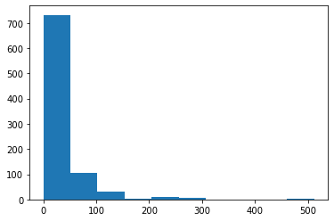
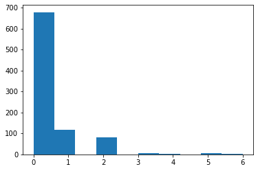

**复习：**在前面我们已经学习了Pandas基础，知道利用Pandas读取csv数据的增删查改，今天我们要学习的就是**探索性数据分析**，主要介绍如何利用Pandas进行排序、算术计算以及计算描述函数describe()的使用。

# 1 第一章：探索性数据分析

#### 开始之前，导入numpy、pandas包和数据


```python
#加载所需的库
import numpy as np
import pandas as pd
```


```python
#载入之前保存的train_chinese.csv数据，关于泰坦尼克号的任务，我们就使用这个数据
text = pd.read_csv('train_chinese.csv')
text.head()
```


<div>
<style scoped>
    .dataframe tbody tr th:only-of-type {
        vertical-align: middle;
    }

    .dataframe tbody tr th {
        vertical-align: top;
    }

    .dataframe thead th {
        text-align: right;
    }
</style>
<table border="1" class="dataframe">
  <thead>
    <tr style="text-align: right;">
      <th></th>
      <th>Unnamed: 0</th>
      <th>乘客ID</th>
      <th>是否幸存</th>
      <th>仓位等级</th>
      <th>姓名</th>
      <th>性别</th>
      <th>年龄</th>
      <th>兄弟姐妹个数</th>
      <th>父母子女个数</th>
      <th>船票信息</th>
      <th>票价</th>
      <th>客舱</th>
      <th>登船港口</th>
    </tr>
  </thead>
  <tbody>
    <tr>
      <th>0</th>
      <td>0</td>
      <td>1</td>
      <td>0</td>
      <td>3</td>
      <td>Braund, Mr. Owen Harris</td>
      <td>male</td>
      <td>22.0</td>
      <td>1</td>
      <td>0</td>
      <td>A/5 21171</td>
      <td>7.2500</td>
      <td>NaN</td>
      <td>S</td>
    </tr>
    <tr>
      <th>1</th>
      <td>1</td>
      <td>2</td>
      <td>1</td>
      <td>1</td>
      <td>Cumings, Mrs. John Bradley (Florence Briggs Th...</td>
      <td>female</td>
      <td>38.0</td>
      <td>1</td>
      <td>0</td>
      <td>PC 17599</td>
      <td>71.2833</td>
      <td>C85</td>
      <td>C</td>
    </tr>
    <tr>
      <th>2</th>
      <td>2</td>
      <td>3</td>
      <td>1</td>
      <td>3</td>
      <td>Heikkinen, Miss. Laina</td>
      <td>female</td>
      <td>26.0</td>
      <td>0</td>
      <td>0</td>
      <td>STON/O2. 3101282</td>
      <td>7.9250</td>
      <td>NaN</td>
      <td>S</td>
    </tr>
    <tr>
      <th>3</th>
      <td>3</td>
      <td>4</td>
      <td>1</td>
      <td>1</td>
      <td>Futrelle, Mrs. Jacques Heath (Lily May Peel)</td>
      <td>female</td>
      <td>35.0</td>
      <td>1</td>
      <td>0</td>
      <td>113803</td>
      <td>53.1000</td>
      <td>C123</td>
      <td>S</td>
    </tr>
    <tr>
      <th>4</th>
      <td>4</td>
      <td>5</td>
      <td>0</td>
      <td>3</td>
      <td>Allen, Mr. William Henry</td>
      <td>male</td>
      <td>35.0</td>
      <td>0</td>
      <td>0</td>
      <td>373450</td>
      <td>8.0500</td>
      <td>NaN</td>
      <td>S</td>
    </tr>
  </tbody>
</table>
</div>


### 1.6 了解你的数据吗？
教材《Python for Data Analysis》第五章

#### 1.6.1 任务一：利用Pandas对示例数据进行排序，要求升序


```python
# 此为random的方式生成dataframe
frame1 = pd.DataFrame(np.random.randn(2, 4), 
                     index=list('21'), 
                     columns=list('dabc'))
frame1
```


<div>
<style scoped>
    .dataframe tbody tr th:only-of-type {
        vertical-align: middle;
    }

    .dataframe tbody tr th {
        vertical-align: top;
    }

    .dataframe thead th {
        text-align: right;
    }
</style>
<table border="1" class="dataframe">
  <thead>
    <tr style="text-align: right;">
      <th></th>
      <th>d</th>
      <th>a</th>
      <th>b</th>
      <th>c</th>
    </tr>
  </thead>
  <tbody>
    <tr>
      <th>2</th>
      <td>1.014903</td>
      <td>1.202835</td>
      <td>-0.311746</td>
      <td>-0.539463</td>
    </tr>
    <tr>
      <th>1</th>
      <td>0.246410</td>
      <td>1.281236</td>
      <td>-1.763604</td>
      <td>0.082269</td>
    </tr>
  </tbody>
</table>
</div>


```python
# 具体请看《利用Python进行数据分析》第五章 排序和排名 部分

#自己构建一个都为数字的DataFrame数据

frame = pd.DataFrame(np.arange(8).reshape((2, 4)), 
                     index=['2', '1'], 
                     columns=['d', 'a', 'b', 'c'])
frame

```


<div>
<style scoped>
    .dataframe tbody tr th:only-of-type {
        vertical-align: middle;
    }

    .dataframe tbody tr th {
        vertical-align: top;
    }

    .dataframe thead th {
        text-align: right;
    }
</style>
<table border="1" class="dataframe">
  <thead>
    <tr style="text-align: right;">
      <th></th>
      <th>d</th>
      <th>a</th>
      <th>b</th>
      <th>c</th>
    </tr>
  </thead>
  <tbody>
    <tr>
      <th>2</th>
      <td>0</td>
      <td>1</td>
      <td>2</td>
      <td>3</td>
    </tr>
    <tr>
      <th>1</th>
      <td>4</td>
      <td>5</td>
      <td>6</td>
      <td>7</td>
    </tr>
  </tbody>
</table>
</div>


【代码解析】

pd.DataFrame() ：创建一个DataFrame对象 

np.arange(8).reshape((2, 4)) : 生成一个二维数组（2*4）,第一列：0，1，2，3 第二列：4，5，6，7

index=['2, 1] ：DataFrame 对象的索引列

columns=['d', 'a', 'b', 'c'] ：DataFrame 对象的索引行

【问题】：大多数时候我们都是想根据列的值来排序,所以将你构建的DataFrame中的数据根据某一列，升序排列


```python
#回答代码
frame1.sort_values(by='c', ascending=False)
```


<div>
<style scoped>
    .dataframe tbody tr th:only-of-type {
        vertical-align: middle;
    }

    .dataframe tbody tr th {
        vertical-align: top;
    }

    .dataframe thead th {
        text-align: right;
    }
</style>
<table border="1" class="dataframe">
  <thead>
    <tr style="text-align: right;">
      <th></th>
      <th>d</th>
      <th>a</th>
      <th>b</th>
      <th>c</th>
    </tr>
  </thead>
  <tbody>
    <tr>
      <th>1</th>
      <td>0.246410</td>
      <td>1.281236</td>
      <td>-1.763604</td>
      <td>0.082269</td>
    </tr>
    <tr>
      <th>2</th>
      <td>1.014903</td>
      <td>1.202835</td>
      <td>-0.311746</td>
      <td>-0.539463</td>
    </tr>
  </tbody>
</table>
</div>


【思考】通过书本你能说出Pandas对DataFrame数据的其他排序方式吗？

【总结】下面将不同的排序方式做一个总结

1.让行索引升序排序


```python
frame1.sort_index()#代码

```


<div>
<style scoped>
    .dataframe tbody tr th:only-of-type {
        vertical-align: middle;
    }

    .dataframe tbody tr th {
        vertical-align: top;
    }

    .dataframe thead th {
        text-align: right;
    }
</style>
<table border="1" class="dataframe">
  <thead>
    <tr style="text-align: right;">
      <th></th>
      <th>d</th>
      <th>a</th>
      <th>b</th>
      <th>c</th>
    </tr>
  </thead>
  <tbody>
    <tr>
      <th>1</th>
      <td>0.246410</td>
      <td>1.281236</td>
      <td>-1.763604</td>
      <td>0.082269</td>
    </tr>
    <tr>
      <th>2</th>
      <td>1.014903</td>
      <td>1.202835</td>
      <td>-0.311746</td>
      <td>-0.539463</td>
    </tr>
  </tbody>
</table>
</div>


2.让列索引升序排序 ：axis=1为列,axis=0为行（默认）


```python
frame1.sort_index(axis=1)#代码

```


<div>
<style scoped>
    .dataframe tbody tr th:only-of-type {
        vertical-align: middle;
    }

    .dataframe tbody tr th {
        vertical-align: top;
    }

    .dataframe thead th {
        text-align: right;
    }
</style>
<table border="1" class="dataframe">
  <thead>
    <tr style="text-align: right;">
      <th></th>
      <th>a</th>
      <th>b</th>
      <th>c</th>
      <th>d</th>
    </tr>
  </thead>
  <tbody>
    <tr>
      <th>2</th>
      <td>1.202835</td>
      <td>-0.311746</td>
      <td>-0.539463</td>
      <td>1.014903</td>
    </tr>
    <tr>
      <th>1</th>
      <td>1.281236</td>
      <td>-1.763604</td>
      <td>0.082269</td>
      <td>0.246410</td>
    </tr>
  </tbody>
</table>
</div>


3.让列索引降序排序


```python
frame1.sort_index(axis=1,ascending=False)#代码
```


<div>
<style scoped>
    .dataframe tbody tr th:only-of-type {
        vertical-align: middle;
    }

    .dataframe tbody tr th {
        vertical-align: top;
    }

    .dataframe thead th {
        text-align: right;
    }
</style>
<table border="1" class="dataframe">
  <thead>
    <tr style="text-align: right;">
      <th></th>
      <th>d</th>
      <th>c</th>
      <th>b</th>
      <th>a</th>
    </tr>
  </thead>
  <tbody>
    <tr>
      <th>2</th>
      <td>1.014903</td>
      <td>-0.539463</td>
      <td>-0.311746</td>
      <td>1.202835</td>
    </tr>
    <tr>
      <th>1</th>
      <td>0.246410</td>
      <td>0.082269</td>
      <td>-1.763604</td>
      <td>1.281236</td>
    </tr>
  </tbody>
</table>
</div>


4.让任选两列数据同时降序排序:前面三种方法为sort_index，第四种为sort_value


```python
frame1.sort_values(by=['d', 'c'], ascending=False)#代码

```


<div>
<style scoped>
    .dataframe tbody tr th:only-of-type {
        vertical-align: middle;
    }

    .dataframe tbody tr th {
        vertical-align: top;
    }

    .dataframe thead th {
        text-align: right;
    }
</style>
<table border="1" class="dataframe">
  <thead>
    <tr style="text-align: right;">
      <th></th>
      <th>d</th>
      <th>a</th>
      <th>b</th>
      <th>c</th>
    </tr>
  </thead>
  <tbody>
    <tr>
      <th>2</th>
      <td>1.014903</td>
      <td>1.202835</td>
      <td>-0.311746</td>
      <td>-0.539463</td>
    </tr>
    <tr>
      <th>1</th>
      <td>0.246410</td>
      <td>1.281236</td>
      <td>-1.763604</td>
      <td>0.082269</td>
    </tr>
  </tbody>
</table>
</div>


#### 1.6.2 任务二：对泰坦尼克号数据（trian.csv）按票价和年龄两列进行综合排序（降序排列），从这个数据中你可以分析出什么？


```python
'''
在开始我们已经导入了train_chinese.csv数据，而且前面我们也学习了导入数据过程，根据上面学习，我们直接对目标列进行排序即可
head(20) : 读取前20条数据

'''
text.sort_values(by=['票价', '年龄'],ascending=False).head(20)
```


<div>
<style scoped>
    .dataframe tbody tr th:only-of-type {
        vertical-align: middle;
    }

    .dataframe tbody tr th {
        vertical-align: top;
    }

    .dataframe thead th {
        text-align: right;
    }
</style>
<table border="1" class="dataframe">
  <thead>
    <tr style="text-align: right;">
      <th></th>
      <th>Unnamed: 0</th>
      <th>乘客ID</th>
      <th>是否幸存</th>
      <th>仓位等级</th>
      <th>姓名</th>
      <th>性别</th>
      <th>年龄</th>
      <th>兄弟姐妹个数</th>
      <th>父母子女个数</th>
      <th>船票信息</th>
      <th>票价</th>
      <th>客舱</th>
      <th>登船港口</th>
    </tr>
  </thead>
  <tbody>
    <tr>
      <th>679</th>
      <td>679</td>
      <td>680</td>
      <td>1</td>
      <td>1</td>
      <td>Cardeza, Mr. Thomas Drake Martinez</td>
      <td>male</td>
      <td>36.0</td>
      <td>0</td>
      <td>1</td>
      <td>PC 17755</td>
      <td>512.3292</td>
      <td>B51 B53 B55</td>
      <td>C</td>
    </tr>
    <tr>
      <th>258</th>
      <td>258</td>
      <td>259</td>
      <td>1</td>
      <td>1</td>
      <td>Ward, Miss. Anna</td>
      <td>female</td>
      <td>35.0</td>
      <td>0</td>
      <td>0</td>
      <td>PC 17755</td>
      <td>512.3292</td>
      <td>NaN</td>
      <td>C</td>
    </tr>
    <tr>
      <th>737</th>
      <td>737</td>
      <td>738</td>
      <td>1</td>
      <td>1</td>
      <td>Lesurer, Mr. Gustave J</td>
      <td>male</td>
      <td>35.0</td>
      <td>0</td>
      <td>0</td>
      <td>PC 17755</td>
      <td>512.3292</td>
      <td>B101</td>
      <td>C</td>
    </tr>
    <tr>
      <th>438</th>
      <td>438</td>
      <td>439</td>
      <td>0</td>
      <td>1</td>
      <td>Fortune, Mr. Mark</td>
      <td>male</td>
      <td>64.0</td>
      <td>1</td>
      <td>4</td>
      <td>19950</td>
      <td>263.0000</td>
      <td>C23 C25 C27</td>
      <td>S</td>
    </tr>
    <tr>
      <th>341</th>
      <td>341</td>
      <td>342</td>
      <td>1</td>
      <td>1</td>
      <td>Fortune, Miss. Alice Elizabeth</td>
      <td>female</td>
      <td>24.0</td>
      <td>3</td>
      <td>2</td>
      <td>19950</td>
      <td>263.0000</td>
      <td>C23 C25 C27</td>
      <td>S</td>
    </tr>
    <tr>
      <th>88</th>
      <td>88</td>
      <td>89</td>
      <td>1</td>
      <td>1</td>
      <td>Fortune, Miss. Mabel Helen</td>
      <td>female</td>
      <td>23.0</td>
      <td>3</td>
      <td>2</td>
      <td>19950</td>
      <td>263.0000</td>
      <td>C23 C25 C27</td>
      <td>S</td>
    </tr>
    <tr>
      <th>27</th>
      <td>27</td>
      <td>28</td>
      <td>0</td>
      <td>1</td>
      <td>Fortune, Mr. Charles Alexander</td>
      <td>male</td>
      <td>19.0</td>
      <td>3</td>
      <td>2</td>
      <td>19950</td>
      <td>263.0000</td>
      <td>C23 C25 C27</td>
      <td>S</td>
    </tr>
    <tr>
      <th>742</th>
      <td>742</td>
      <td>743</td>
      <td>1</td>
      <td>1</td>
      <td>Ryerson, Miss. Susan Parker "Suzette"</td>
      <td>female</td>
      <td>21.0</td>
      <td>2</td>
      <td>2</td>
      <td>PC 17608</td>
      <td>262.3750</td>
      <td>B57 B59 B63 B66</td>
      <td>C</td>
    </tr>
    <tr>
      <th>311</th>
      <td>311</td>
      <td>312</td>
      <td>1</td>
      <td>1</td>
      <td>Ryerson, Miss. Emily Borie</td>
      <td>female</td>
      <td>18.0</td>
      <td>2</td>
      <td>2</td>
      <td>PC 17608</td>
      <td>262.3750</td>
      <td>B57 B59 B63 B66</td>
      <td>C</td>
    </tr>
    <tr>
      <th>299</th>
      <td>299</td>
      <td>300</td>
      <td>1</td>
      <td>1</td>
      <td>Baxter, Mrs. James (Helene DeLaudeniere Chaput)</td>
      <td>female</td>
      <td>50.0</td>
      <td>0</td>
      <td>1</td>
      <td>PC 17558</td>
      <td>247.5208</td>
      <td>B58 B60</td>
      <td>C</td>
    </tr>
    <tr>
      <th>118</th>
      <td>118</td>
      <td>119</td>
      <td>0</td>
      <td>1</td>
      <td>Baxter, Mr. Quigg Edmond</td>
      <td>male</td>
      <td>24.0</td>
      <td>0</td>
      <td>1</td>
      <td>PC 17558</td>
      <td>247.5208</td>
      <td>B58 B60</td>
      <td>C</td>
    </tr>
    <tr>
      <th>380</th>
      <td>380</td>
      <td>381</td>
      <td>1</td>
      <td>1</td>
      <td>Bidois, Miss. Rosalie</td>
      <td>female</td>
      <td>42.0</td>
      <td>0</td>
      <td>0</td>
      <td>PC 17757</td>
      <td>227.5250</td>
      <td>NaN</td>
      <td>C</td>
    </tr>
    <tr>
      <th>716</th>
      <td>716</td>
      <td>717</td>
      <td>1</td>
      <td>1</td>
      <td>Endres, Miss. Caroline Louise</td>
      <td>female</td>
      <td>38.0</td>
      <td>0</td>
      <td>0</td>
      <td>PC 17757</td>
      <td>227.5250</td>
      <td>C45</td>
      <td>C</td>
    </tr>
    <tr>
      <th>700</th>
      <td>700</td>
      <td>701</td>
      <td>1</td>
      <td>1</td>
      <td>Astor, Mrs. John Jacob (Madeleine Talmadge Force)</td>
      <td>female</td>
      <td>18.0</td>
      <td>1</td>
      <td>0</td>
      <td>PC 17757</td>
      <td>227.5250</td>
      <td>C62 C64</td>
      <td>C</td>
    </tr>
    <tr>
      <th>557</th>
      <td>557</td>
      <td>558</td>
      <td>0</td>
      <td>1</td>
      <td>Robbins, Mr. Victor</td>
      <td>male</td>
      <td>NaN</td>
      <td>0</td>
      <td>0</td>
      <td>PC 17757</td>
      <td>227.5250</td>
      <td>NaN</td>
      <td>C</td>
    </tr>
    <tr>
      <th>527</th>
      <td>527</td>
      <td>528</td>
      <td>0</td>
      <td>1</td>
      <td>Farthing, Mr. John</td>
      <td>male</td>
      <td>NaN</td>
      <td>0</td>
      <td>0</td>
      <td>PC 17483</td>
      <td>221.7792</td>
      <td>C95</td>
      <td>S</td>
    </tr>
    <tr>
      <th>377</th>
      <td>377</td>
      <td>378</td>
      <td>0</td>
      <td>1</td>
      <td>Widener, Mr. Harry Elkins</td>
      <td>male</td>
      <td>27.0</td>
      <td>0</td>
      <td>2</td>
      <td>113503</td>
      <td>211.5000</td>
      <td>C82</td>
      <td>C</td>
    </tr>
    <tr>
      <th>779</th>
      <td>779</td>
      <td>780</td>
      <td>1</td>
      <td>1</td>
      <td>Robert, Mrs. Edward Scott (Elisabeth Walton Mc...</td>
      <td>female</td>
      <td>43.0</td>
      <td>0</td>
      <td>1</td>
      <td>24160</td>
      <td>211.3375</td>
      <td>B3</td>
      <td>S</td>
    </tr>
    <tr>
      <th>730</th>
      <td>730</td>
      <td>731</td>
      <td>1</td>
      <td>1</td>
      <td>Allen, Miss. Elisabeth Walton</td>
      <td>female</td>
      <td>29.0</td>
      <td>0</td>
      <td>0</td>
      <td>24160</td>
      <td>211.3375</td>
      <td>B5</td>
      <td>S</td>
    </tr>
    <tr>
      <th>689</th>
      <td>689</td>
      <td>690</td>
      <td>1</td>
      <td>1</td>
      <td>Madill, Miss. Georgette Alexandra</td>
      <td>female</td>
      <td>15.0</td>
      <td>0</td>
      <td>1</td>
      <td>24160</td>
      <td>211.3375</td>
      <td>B5</td>
      <td>S</td>
    </tr>
  </tbody>
</table>
</div>


【思考】排序后，如果我们仅仅关注年龄和票价两列。根据常识我知道发现票价越高的应该客舱越好，所以我们会明显看出，票价前20的乘客中存活的有14人，这是相当高的一个比例，那么我们后面是不是可以进一步分析一下票价和存活之间的关系，年龄和存活之间的关系呢？当你开始发现数据之间的关系了，数据分析就开始了。

当然，这只是我的想法，你还可以有更多想法，欢迎写在你的学习笔记中。

**多做几个数据的排序**


```python
text.sort_values(by=['年龄','票价'],ascending=False).head(20)

```


<div>
<style scoped>
    .dataframe tbody tr th:only-of-type {
        vertical-align: middle;
    }

    .dataframe tbody tr th {
        vertical-align: top;
    }

    .dataframe thead th {
        text-align: right;
    }
</style>
<table border="1" class="dataframe">
  <thead>
    <tr style="text-align: right;">
      <th></th>
      <th>Unnamed: 0</th>
      <th>乘客ID</th>
      <th>是否幸存</th>
      <th>仓位等级</th>
      <th>姓名</th>
      <th>性别</th>
      <th>年龄</th>
      <th>兄弟姐妹个数</th>
      <th>父母子女个数</th>
      <th>船票信息</th>
      <th>票价</th>
      <th>客舱</th>
      <th>登船港口</th>
    </tr>
  </thead>
  <tbody>
    <tr>
      <th>630</th>
      <td>630</td>
      <td>631</td>
      <td>1</td>
      <td>1</td>
      <td>Barkworth, Mr. Algernon Henry Wilson</td>
      <td>male</td>
      <td>80.0</td>
      <td>0</td>
      <td>0</td>
      <td>27042</td>
      <td>30.0000</td>
      <td>A23</td>
      <td>S</td>
    </tr>
    <tr>
      <th>851</th>
      <td>851</td>
      <td>852</td>
      <td>0</td>
      <td>3</td>
      <td>Svensson, Mr. Johan</td>
      <td>male</td>
      <td>74.0</td>
      <td>0</td>
      <td>0</td>
      <td>347060</td>
      <td>7.7750</td>
      <td>NaN</td>
      <td>S</td>
    </tr>
    <tr>
      <th>493</th>
      <td>493</td>
      <td>494</td>
      <td>0</td>
      <td>1</td>
      <td>Artagaveytia, Mr. Ramon</td>
      <td>male</td>
      <td>71.0</td>
      <td>0</td>
      <td>0</td>
      <td>PC 17609</td>
      <td>49.5042</td>
      <td>NaN</td>
      <td>C</td>
    </tr>
    <tr>
      <th>96</th>
      <td>96</td>
      <td>97</td>
      <td>0</td>
      <td>1</td>
      <td>Goldschmidt, Mr. George B</td>
      <td>male</td>
      <td>71.0</td>
      <td>0</td>
      <td>0</td>
      <td>PC 17754</td>
      <td>34.6542</td>
      <td>A5</td>
      <td>C</td>
    </tr>
    <tr>
      <th>116</th>
      <td>116</td>
      <td>117</td>
      <td>0</td>
      <td>3</td>
      <td>Connors, Mr. Patrick</td>
      <td>male</td>
      <td>70.5</td>
      <td>0</td>
      <td>0</td>
      <td>370369</td>
      <td>7.7500</td>
      <td>NaN</td>
      <td>Q</td>
    </tr>
    <tr>
      <th>745</th>
      <td>745</td>
      <td>746</td>
      <td>0</td>
      <td>1</td>
      <td>Crosby, Capt. Edward Gifford</td>
      <td>male</td>
      <td>70.0</td>
      <td>1</td>
      <td>1</td>
      <td>WE/P 5735</td>
      <td>71.0000</td>
      <td>B22</td>
      <td>S</td>
    </tr>
    <tr>
      <th>672</th>
      <td>672</td>
      <td>673</td>
      <td>0</td>
      <td>2</td>
      <td>Mitchell, Mr. Henry Michael</td>
      <td>male</td>
      <td>70.0</td>
      <td>0</td>
      <td>0</td>
      <td>C.A. 24580</td>
      <td>10.5000</td>
      <td>NaN</td>
      <td>S</td>
    </tr>
    <tr>
      <th>33</th>
      <td>33</td>
      <td>34</td>
      <td>0</td>
      <td>2</td>
      <td>Wheadon, Mr. Edward H</td>
      <td>male</td>
      <td>66.0</td>
      <td>0</td>
      <td>0</td>
      <td>C.A. 24579</td>
      <td>10.5000</td>
      <td>NaN</td>
      <td>S</td>
    </tr>
    <tr>
      <th>54</th>
      <td>54</td>
      <td>55</td>
      <td>0</td>
      <td>1</td>
      <td>Ostby, Mr. Engelhart Cornelius</td>
      <td>male</td>
      <td>65.0</td>
      <td>0</td>
      <td>1</td>
      <td>113509</td>
      <td>61.9792</td>
      <td>B30</td>
      <td>C</td>
    </tr>
    <tr>
      <th>456</th>
      <td>456</td>
      <td>457</td>
      <td>0</td>
      <td>1</td>
      <td>Millet, Mr. Francis Davis</td>
      <td>male</td>
      <td>65.0</td>
      <td>0</td>
      <td>0</td>
      <td>13509</td>
      <td>26.5500</td>
      <td>E38</td>
      <td>S</td>
    </tr>
    <tr>
      <th>280</th>
      <td>280</td>
      <td>281</td>
      <td>0</td>
      <td>3</td>
      <td>Duane, Mr. Frank</td>
      <td>male</td>
      <td>65.0</td>
      <td>0</td>
      <td>0</td>
      <td>336439</td>
      <td>7.7500</td>
      <td>NaN</td>
      <td>Q</td>
    </tr>
    <tr>
      <th>438</th>
      <td>438</td>
      <td>439</td>
      <td>0</td>
      <td>1</td>
      <td>Fortune, Mr. Mark</td>
      <td>male</td>
      <td>64.0</td>
      <td>1</td>
      <td>4</td>
      <td>19950</td>
      <td>263.0000</td>
      <td>C23 C25 C27</td>
      <td>S</td>
    </tr>
    <tr>
      <th>545</th>
      <td>545</td>
      <td>546</td>
      <td>0</td>
      <td>1</td>
      <td>Nicholson, Mr. Arthur Ernest</td>
      <td>male</td>
      <td>64.0</td>
      <td>0</td>
      <td>0</td>
      <td>693</td>
      <td>26.0000</td>
      <td>NaN</td>
      <td>S</td>
    </tr>
    <tr>
      <th>275</th>
      <td>275</td>
      <td>276</td>
      <td>1</td>
      <td>1</td>
      <td>Andrews, Miss. Kornelia Theodosia</td>
      <td>female</td>
      <td>63.0</td>
      <td>1</td>
      <td>0</td>
      <td>13502</td>
      <td>77.9583</td>
      <td>D7</td>
      <td>S</td>
    </tr>
    <tr>
      <th>483</th>
      <td>483</td>
      <td>484</td>
      <td>1</td>
      <td>3</td>
      <td>Turkula, Mrs. (Hedwig)</td>
      <td>female</td>
      <td>63.0</td>
      <td>0</td>
      <td>0</td>
      <td>4134</td>
      <td>9.5875</td>
      <td>NaN</td>
      <td>S</td>
    </tr>
    <tr>
      <th>829</th>
      <td>829</td>
      <td>830</td>
      <td>1</td>
      <td>1</td>
      <td>Stone, Mrs. George Nelson (Martha Evelyn)</td>
      <td>female</td>
      <td>62.0</td>
      <td>0</td>
      <td>0</td>
      <td>113572</td>
      <td>80.0000</td>
      <td>B28</td>
      <td>NaN</td>
    </tr>
    <tr>
      <th>252</th>
      <td>252</td>
      <td>253</td>
      <td>0</td>
      <td>1</td>
      <td>Stead, Mr. William Thomas</td>
      <td>male</td>
      <td>62.0</td>
      <td>0</td>
      <td>0</td>
      <td>113514</td>
      <td>26.5500</td>
      <td>C87</td>
      <td>S</td>
    </tr>
    <tr>
      <th>555</th>
      <td>555</td>
      <td>556</td>
      <td>0</td>
      <td>1</td>
      <td>Wright, Mr. George</td>
      <td>male</td>
      <td>62.0</td>
      <td>0</td>
      <td>0</td>
      <td>113807</td>
      <td>26.5500</td>
      <td>NaN</td>
      <td>S</td>
    </tr>
    <tr>
      <th>570</th>
      <td>570</td>
      <td>571</td>
      <td>1</td>
      <td>2</td>
      <td>Harris, Mr. George</td>
      <td>male</td>
      <td>62.0</td>
      <td>0</td>
      <td>0</td>
      <td>S.W./PP 752</td>
      <td>10.5000</td>
      <td>NaN</td>
      <td>S</td>
    </tr>
    <tr>
      <th>170</th>
      <td>170</td>
      <td>171</td>
      <td>0</td>
      <td>1</td>
      <td>Van der hoef, Mr. Wyckoff</td>
      <td>male</td>
      <td>61.0</td>
      <td>0</td>
      <td>0</td>
      <td>111240</td>
      <td>33.5000</td>
      <td>B19</td>
      <td>S</td>
    </tr>
  </tbody>
</table>
</div>


综合排序，先按照第一个索引降序（票价），在按照第二个索引降序（年龄）

#### 1.6.3 任务三：利用Pandas进行算术计算，计算两个DataFrame数据相加结果


```python
# 具体请看《利用Python进行数据分析》第五章 算术运算与数据对齐 部分

#自己构建两个都为数字的DataFrame数据
frame1_a = pd.DataFrame(np.arange(9.).reshape(3, 3),
                     columns=['a', 'b', 'c'],
                     index=['one', 'two', 'three'])
frame1_b = pd.DataFrame(np.arange(12.).reshape(4, 3),
                     columns=['a', 'e', 'c'],
                     index=['first', 'one', 'two', 'second'])
frame1_a
```


<div>
<style scoped>
    .dataframe tbody tr th:only-of-type {
        vertical-align: middle;
    }

    .dataframe tbody tr th {
        vertical-align: top;
    }

    .dataframe thead th {
        text-align: right;
    }
</style>
<table border="1" class="dataframe">
  <thead>
    <tr style="text-align: right;">
      <th></th>
      <th>a</th>
      <th>b</th>
      <th>c</th>
    </tr>
  </thead>
  <tbody>
    <tr>
      <th>one</th>
      <td>0.0</td>
      <td>1.0</td>
      <td>2.0</td>
    </tr>
    <tr>
      <th>two</th>
      <td>3.0</td>
      <td>4.0</td>
      <td>5.0</td>
    </tr>
    <tr>
      <th>three</th>
      <td>6.0</td>
      <td>7.0</td>
      <td>8.0</td>
    </tr>
  </tbody>
</table>
</div>


```python
frame1_b

```


<div>
<style scoped>
    .dataframe tbody tr th:only-of-type {
        vertical-align: middle;
    }

    .dataframe tbody tr th {
        vertical-align: top;
    }

    .dataframe thead th {
        text-align: right;
    }
</style>
<table border="1" class="dataframe">
  <thead>
    <tr style="text-align: right;">
      <th></th>
      <th>a</th>
      <th>e</th>
      <th>c</th>
    </tr>
  </thead>
  <tbody>
    <tr>
      <th>first</th>
      <td>0.0</td>
      <td>1.0</td>
      <td>2.0</td>
    </tr>
    <tr>
      <th>one</th>
      <td>3.0</td>
      <td>4.0</td>
      <td>5.0</td>
    </tr>
    <tr>
      <th>two</th>
      <td>6.0</td>
      <td>7.0</td>
      <td>8.0</td>
    </tr>
    <tr>
      <th>second</th>
      <td>9.0</td>
      <td>10.0</td>
      <td>11.0</td>
    </tr>
  </tbody>
</table>
</div>


将frame_a和frame_b进行相加


```python
frame1_a+frame1_b

```


<div>
<style scoped>
    .dataframe tbody tr th:only-of-type {
        vertical-align: middle;
    }

    .dataframe tbody tr th {
        vertical-align: top;
    }

    .dataframe thead th {
        text-align: right;
    }
</style>
<table border="1" class="dataframe">
  <thead>
    <tr style="text-align: right;">
      <th></th>
      <th>a</th>
      <th>b</th>
      <th>c</th>
      <th>e</th>
    </tr>
  </thead>
  <tbody>
    <tr>
      <th>first</th>
      <td>NaN</td>
      <td>NaN</td>
      <td>NaN</td>
      <td>NaN</td>
    </tr>
    <tr>
      <th>one</th>
      <td>3.0</td>
      <td>NaN</td>
      <td>7.0</td>
      <td>NaN</td>
    </tr>
    <tr>
      <th>second</th>
      <td>NaN</td>
      <td>NaN</td>
      <td>NaN</td>
      <td>NaN</td>
    </tr>
    <tr>
      <th>three</th>
      <td>NaN</td>
      <td>NaN</td>
      <td>NaN</td>
      <td>NaN</td>
    </tr>
    <tr>
      <th>two</th>
      <td>9.0</td>
      <td>NaN</td>
      <td>13.0</td>
      <td>NaN</td>
    </tr>
  </tbody>
</table>
</div>


【提醒】两个DataFrame相加后，会返回一个新的DataFrame，对应的行和列的值会相加，没有对应的会变成空值NaN。<br>
当然，DataFrame还有很多算术运算，如减法，除法等，有兴趣的同学可以看《利用Python进行数据分析》第五章 算术运算与数据对齐 部分，多在网络上查找相关学习资料。

#### 1.6.4 任务四：通过泰坦尼克号数据如何计算出在船上最大的家族有多少人？


```python
'''
还是用之前导入的chinese_train.csv如果我们想看看在船上，最大的家族有多少人（‘兄弟姐妹个数’+‘父母子女个数’），我们该怎么做呢？
'''
text['兄弟姐妹个数'] 
```


    0      1
    1      1
    2      0
    3      1
    4      0
          ..
    886    0
    887    0
    888    1
    889    0
    890    0
    Name: 兄弟姐妹个数, Length: 891, dtype: int64


```python
max(text['兄弟姐妹个数'] + text['父母子女个数'])
```


    10


【提醒】利用dataframe对应列相加，即使两个dataframe大小不一样。因此我们只需找出”兄弟姐妹个数“和”父母子女个数“之和最大的数，当然你还可以想出很多方法和思考角度，欢迎你来说出你的看法。

#### 1.6.5 任务五：学会使用Pandas describe()函数查看数据基本统计信息


```python
#(1) 关键知识点示例做一遍（简单数据）
# 具体请看《利用Python进行数据分析》第五章 汇总和计算描述统计 部分

#自己构建一个有数字有空值的DataFrame数据

frame2 = pd.DataFrame([[1.4, np.nan], 
                       [7.1, -4.5],
                       [np.nan, np.nan], 
                       [0.75, -1.3]
                      ], index=['a', 'b', 'c', 'd'], columns=['one', 'two'])
frame2
```


<div>
<style scoped>
    .dataframe tbody tr th:only-of-type {
        vertical-align: middle;
    }

    .dataframe tbody tr th {
        vertical-align: top;
    }

    .dataframe thead th {
        text-align: right;
    }
</style>
<table border="1" class="dataframe">
  <thead>
    <tr style="text-align: right;">
      <th></th>
      <th>one</th>
      <th>two</th>
    </tr>
  </thead>
  <tbody>
    <tr>
      <th>a</th>
      <td>1.40</td>
      <td>NaN</td>
    </tr>
    <tr>
      <th>b</th>
      <td>7.10</td>
      <td>-4.5</td>
    </tr>
    <tr>
      <th>c</th>
      <td>NaN</td>
      <td>NaN</td>
    </tr>
    <tr>
      <th>d</th>
      <td>0.75</td>
      <td>-1.3</td>
    </tr>
  </tbody>
</table>
</div>


调用 describe 函数，观察frame2的数据基本信息


```python
frame2.describe()#代码
'''
count : 样本数据大小
mean : 样本数据的平均值
std : 样本数据的标准差
min : 样本数据的最小值
25% : 样本数据25%的时候的值
50% : 样本数据50%的时候的值
75% : 样本数据75%的时候的值
max : 样本数据的最大值
'''
```


<div>
<style scoped>
    .dataframe tbody tr th:only-of-type {
        vertical-align: middle;
    }

    .dataframe tbody tr th {
        vertical-align: top;
    }

    .dataframe thead th {
        text-align: right;
    }
</style>
<table border="1" class="dataframe">
  <thead>
    <tr style="text-align: right;">
      <th></th>
      <th>one</th>
      <th>two</th>
    </tr>
  </thead>
  <tbody>
    <tr>
      <th>count</th>
      <td>3.000000</td>
      <td>2.000000</td>
    </tr>
    <tr>
      <th>mean</th>
      <td>3.083333</td>
      <td>-2.900000</td>
    </tr>
    <tr>
      <th>std</th>
      <td>3.493685</td>
      <td>2.262742</td>
    </tr>
    <tr>
      <th>min</th>
      <td>0.750000</td>
      <td>-4.500000</td>
    </tr>
    <tr>
      <th>25%</th>
      <td>1.075000</td>
      <td>-3.700000</td>
    </tr>
    <tr>
      <th>50%</th>
      <td>1.400000</td>
      <td>-2.900000</td>
    </tr>
    <tr>
      <th>75%</th>
      <td>4.250000</td>
      <td>-2.100000</td>
    </tr>
    <tr>
      <th>max</th>
      <td>7.100000</td>
      <td>-1.300000</td>
    </tr>
  </tbody>
</table>
</div>


#### 1.6.6 任务六：分别看看泰坦尼克号数据集中 票价、父母子女 这列数据的基本统计数据，你能发现什么？


```python
'''
看看泰坦尼克号数据集中 票价 这列数据的基本统计数据
'''
text['票价'].describe()
```


    count    891.000000
    mean      32.204208
    std       49.693429
    min        0.000000
    25%        7.910400
    50%       14.454200
    75%       31.000000
    max      512.329200
    Name: 票价, dtype: float64


```python
from matplotlib import pyplot as plt
```


```python
plt.hist(text['票价'])
```


    (array([732., 106.,  31.,   2.,  11.,   6.,   0.,   0.,   0.,   3.]),
     array([  0.     ,  51.23292, 102.46584, 153.69876, 204.93168, 256.1646 ,
            307.39752, 358.63044, 409.86336, 461.09628, 512.3292 ]),
     <BarContainer object of 10 artists>)


    

    


【思考】从上面数据我们可以看出，试试在下面写出你的看法。然后看看我们给出的答案。

从上面数据我们可以看出， 一共有891个票价数据， 平均值约为：32.20， 标准差约为49.69，说明票价波动特别大， 25%的人的票价是低于7.91的，50%的人的票价低于14.45，75%的人的票价低于31.00，
——这块像是通过类似直方图统计

票价最大值约为512.33，最小值为0。


**多做几个组数据的统计，看看你能分析出什么？**


```python
text['父母子女个数'].describe()# 写下你的其他分析
```


    count    891.000000
    mean       0.381594
    std        0.806057
    min        0.000000
    25%        0.000000
    50%        0.000000
    75%        0.000000
    max        6.000000
    Name: 父母子女个数, dtype: float64


```python
plt.hist(text['父母子女个数'])
```


    (array([678., 118.,   0.,  80.,   0.,   5.,   4.,   0.,   5.,   1.]),
     array([0. , 0.6, 1.2, 1.8, 2.4, 3. , 3.6, 4.2, 4.8, 5.4, 6. ]),
     <BarContainer object of 10 artists>)


    

    


【思考】有更多想法，欢迎写在你的学习笔记中。

【总结】本节中我们通过Pandas的一些内置函数对数据进行了初步统计查看，这个过程最重要的不是大家得掌握这些函数，而是看懂从这些函数出来的数据，构建自己的数据分析思维，这也是第一章最重要的点，希望大家学完第一章能对数据有个基本认识，了解自己在做什么，为什么这么做，后面的章节我们将开始对数据进行清洗，进一步分析。
